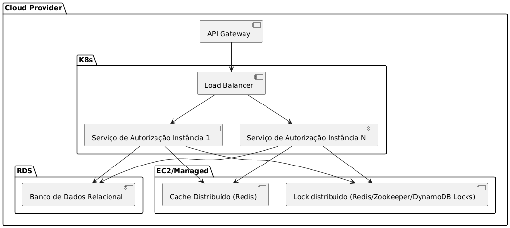

# L4 - Transacoes simultaneas

## Enunciado

- Transações simultâneas: Dado que o mesmo cartão de crédito pode ser utilizado em diferentes serviços online, existe
  uma pequena mas existente probabilidade de ocorrerem duas transações ao mesmo tempo. O que você faria para garantir
  que apenas uma transação por conta fosse processada em um determinado momento? Esteja ciente do fato de que todas as
  solicitações de transação são síncronas e devem ser processadas rapidamente (menos de 100 ms), ou a transação atingirá
  o timeout.
  Para este teste, tente ao máximo implementar um sistema de autorização de transações considerando todos os desafios
  apresentados (L1 a L4) e conceitos básicos.

## Requisitos

- Duas transações para a mesma conta não podem ser processadas simultaneamente.
- O resultado do processamento das transações deve ser síncrono
- O processamento das transações deve ser rápido (menos de 100 ms)

## Solução

Como a solução deve ser síncrona e rápida, a melhor abordagem é implementar um mecanismo de bloqueio distribuído para
garantir a consistência dos dados e a escalabilidade horizontal.
Também pensando em performance, é possível implementar um cache distribuído com o resultado das ultimas transações, para
que seja possível implementar idempotencia de forma performatica.

### Arquitetura

- API Gateway: Recebe as solicitações de transação dos clientes.
- Load Balancer: Distribui as solicitações entre as instâncias do serviço de autorização para garantir carga equalizada.
- K8s: Cluster Kubernetes para orquestração de contêineres
    - Serviço de autorização: Processam as transações. Com pelo menos 2 replicas para garantir alta disponibilidade.
    - AutoScaling pode ser configurado de acordo com a quantidade de requests e da latencia com o auxilio
      do [Keda](https://keda.sh/)
- RDS:
    - Banco de Dados Relacional: Armazena o estado das transações.
- EC2/Managed
    - Cache Distribuído (Redis): Armazena temporariamente os resultados das transações recentes.
    - Redis/Zookeeper/DynamoDB Locks: Coordena o bloqueio distribuído entre as instâncias do serviço de autorização.
        - Redis: Simples e performatico, porém não possui garantia de consistência.
        - Zookeeper: Consistente, porém mais complexo e menos performatico. Também é uma solução mais antiga.
        - DynamoDB: Consistente e performatico, porém mais caro e cria lockin com a AWS. Pode ser mais rapido que o
          Redis
          em casos de alta concorrencia. Pode ser mais rapido para desenvolver, caso a aplicação já execute em AWS.

## Observações

Caso o serviço pudesse responder de forma assíncrona, é possível garantir a ordem de processamento das transações e a
concorrencia utilizando mensagens com Kafka, particionando a fila pelo id da conta.
O retorno poderia ser feito chamando um webhook do solicitante, o link pode ser recebido no payload da transação ou ser
cadastrado previamente (melhor performance e segurança.

Realizar o processamento de forma assíncrona também permite remover a responsabilidade de implementação de retry de quem
consome o serviço.

  